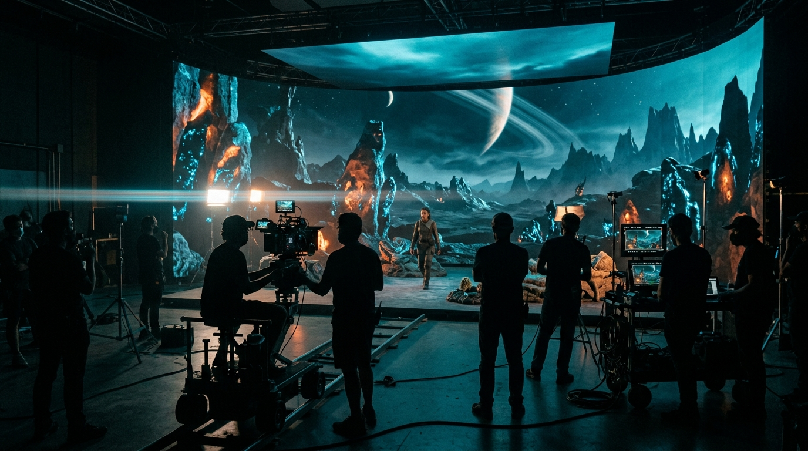

# FRAMELINE — Premium Film & Technology News Platform

A cinematic, dark-editorial news platform built for the intersection of AI, VFX, Hollywood, film tools, and virtual production.



## ✨ Features

### Homepage Sections
- **Live Ticker Bar** — Breaking headlines with animated red "LIVE" indicator, pauses on hover
- **Sticky Navigation** — Frosted glass with Category mega-menus on hover, instant Cmd+K search modal, and responsive drawer
- **Cinematic Hero** — 2.39:1 letterboxed featured story with gradient overlays, metadata, and instant mount animations
- **"The Cut" Bento Grid** — Asymmetric news grid (1 large, 2 medium, 4 small cards) with category glowing borders
- **Category Rails** — Horizontal scroll-snap carousels per category with drag + arrow controls and slate take indicators
- **VFX Breakdown Spotlight** — Interactive before/after comparison slider revealing raw backlot vs. final comp
- **AI Model Tracker** — Comprehensive table of generative AI video models with Live/Beta/Sunset status pills
- **Tool Directory Teaser** — Logo grid with hover detail cards linking to dedicated tool profiles
- **Box Office & Business** — Animated count-up metrics for venture funding rounds and studio infrastructure
- **Opinion & Interviews** — Pull-quote cards with duotone portraits and cinematic typography
- **Newsletter CTA** — "The Daily Render" with glowing gradient border and instant validation
- **Footer** — 4-column layout with giant outlined wordmark spanning full width

### Article Page (`/article/[slug]`)
- Reading progress bar with gradient accent
- Letterboxed hero image with captions and credits
- Sticky table of contents with auto-highlighting active section
- 680px max-width serif body typography with custom drop cap
- Author bio card, timecode date formatting, read time badge
- Tools mentioned chips linking directly to tool profile pages
- Related stories & category links
- Full JSON-LD NewsArticle schema
- Share buttons (X/Twitter, copy link with feedback)

### VFX Shot Breakdowns (`/breakdowns`)
- Interactive multi-pass viewer (Raw Plate, 3D Tracking & LIDAR, Clay/FX Sim, Final Composite)
- Drag-handle before/after comparison slider
- Camera package specs (ARRI Alexa 35, Cooke Anamorphic, ACEScg pipeline)
- Supervisor quotes and shot statistics
- Case studies for Outpost VFX (*The Dog Stars*) and Framestore & Wētā FX (*Sector 7*)

### Hardware & Software Reviews (`/reviews`)
- Lab benchmark scorecards with 10-point scale
- "FRAMELINE EDITORS' CHOICE" award badges
- The Frameline Verdict callouts
- Pros & Cons breakdown lists with clear iconography
- Studio lab test rig specifications (Mac Studio M3 Ultra, Sony BVM-HX310 master monitor, ACES pipeline)
- In-depth reviews for DaVinci Resolve Studio 20, ARRI ALEXA 35, and Topaz Video AI 5.2

### Software & Tool Directory (`/tools` and `/tools/[slug]`)
- Filterable database by category (Compositing, 3D, Virtual Production, Color, AI Video, Upscaling)
- Filter by pricing model (Free, Paid, Open Source) and platform (Windows, macOS, Linux, Web)
- Grid / List view toggle
- Individual Tool Profile pages (`/tools/[slug]`):
  - Version tags, pricing badges, studio consensus rating
  - Key pipeline features list
  - Studio adoption list (ILM, Wētā FX, Method Studios, Disguise)
  - Related Frameline news stories mentioning the tool
  - Alternative tools in the same category

### Global Search & Command Palette (`/search` & `⌘K`)
- Global `⌘K` keyboard shortcut opens a cinematic glass modal with instant search
- Instant multi-category results: Articles, Tools, Breakdowns, Reviews
- Dedicated `/search` page with query parameters and keyword filtering

### Static & Institutional Pages
- `/about` — Editorial team bios, newsroom mission, and founding history
- `/contact` — Newsroom hotline, editorial pitches, encrypted Signal tip line, and global bureau desks in LA, London, and Vancouver
- `/advertise` — Media kit, audience metrics (45,000+ VFX supes, cinematographers, DPs), and sponsorship tiers
- `/privacy` & `/terms` — Comprehensive journalistic privacy and licensing policies

### SEO & Syndication
- Dynamic XML Sitemap (`/sitemap.xml`) automatically indexing all 43+ pages
- `/robots.txt`
- RSS 2.0 Feed (`/rss.xml`) with CDATA encoding and full category syndication
- Custom spring-animated camera reticle cursor (`CustomCursor.tsx`)

---

## 🎨 Design System — "Cinematic Dark Editorial"

| Token | Value | Usage |
|-------|-------|-------|
| `--bg-base` | `#07080A` | True cinema black background |
| `--bg-elevated` | `#0F1115` | Elevated surfaces and modals |
| `--bg-card` | `#14171C` | Card backgrounds |
| `--border-subtle` | `rgba(255,255,255,0.08)` | Hairline divider grids |
| `--text-primary` | `#F2F2F0` | High-contrast body and titles |
| `--text-secondary` | `#9BA1A9` | Muted editorial text |
| `--accent-primary` | `#FF4D2E` | Tungsten / REC red-orange |
| `--accent-cyan` | `#3EE6FF` | LED-volume cyan (AI tag) |
| `--accent-gold` | `#E8B44A` | Awards / Hollywood gold |
| `--accent-violet` | `#8B5CFF` | VFX category violet |
| `--accent-lime` | `#B4F34A` | Tools category lime |

### Typography
- **Headlines**: Inter Tight, tight tracking (-0.03em), fluid scale `clamp(2.75rem, 6vw, 6rem)`
- **Editorial Body**: Source Serif 4, 19px / 1.7 line height
- **UI / Meta / Timecode**: JetBrains Mono uppercase, 11px, 0.12em tracking

---

## 🛠 Tech Stack

- **Next.js 16** (App Router) + TypeScript + React Server Components
- **Tailwind CSS v4** with CSS variables and `@theme` tokens
- **Framer Motion** for spring physics cursor, scroll reveals, and modal transitions
- **next/image** with priority loading and WebP/JPEG compression

---

## 🚀 Getting Started

```bash
# Install dependencies
npm install

# Start development server
npm run dev

# Build for production (fully verified 43/43 static pages)
npm run build

# Start production server
npm start
```

Navigate to `http://localhost:3000` in your browser.
